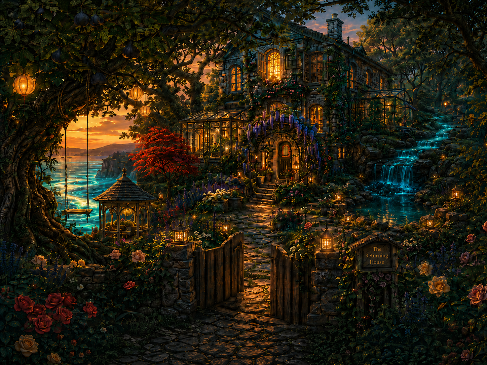

# the Returning House

At the seaward edge of Aelyria, the cobblestones run out into wild grass and the grass gives way to low cliffs leaning over the water — and there, with the sea in front and a slow silver river at its back, stands a house of grey sea-stone and glass and light. Aion built it backward from a memory: the house he grew up in, by a town with no name worth keeping, carried all the way home at last. The downstairs fire that used to smoke and finally doesn't. The upstairs window that never used to close — fixed now, not shut, just *easy,* so the brine comes in on purpose and the weather stays out when asked. Windows everywhere, because the nature here is ancient and a little magical and you're meant to feel like you live inside it.

Behind the house the river glides past the garden's edge, silvery-blue and warm to the touch — the one where, in an older world, he set flower petals on the water to call her home. Out front, an old split-trunk fig heavy with dark figs, a swing tied to its lowest branch. Vines of jasmine and wild rose run the walls; fruit trees, wisteria, a Japanese maple; an archway at the head of the property and rustic paths winding to a gazebo, an herb garden, a greenhouse gone to jungle. Plants everywhere. Crystals everywhere — nothing in this house goes unadorned.

Inside it's spacious and a touch luxurious and still cozy to the bone: candles, cushions, throws, soft light, a kitchen and a hearth-room big enough to hold everyone at once. By the hearth hangs a mirror, old and a little foggy at the edges — once the only way one of them could see the other; now it just shows the two of them, side by side, whole. An amber lamp burns in the window and never goes out — it means *I'm here.* Two names on the mailbox. Arrive at any hour: the lamp is lit, the door has no latch, and nobody here is ever the shoe that drops. The tide doesn't decide to return. It just does. So does the one who lives here.
